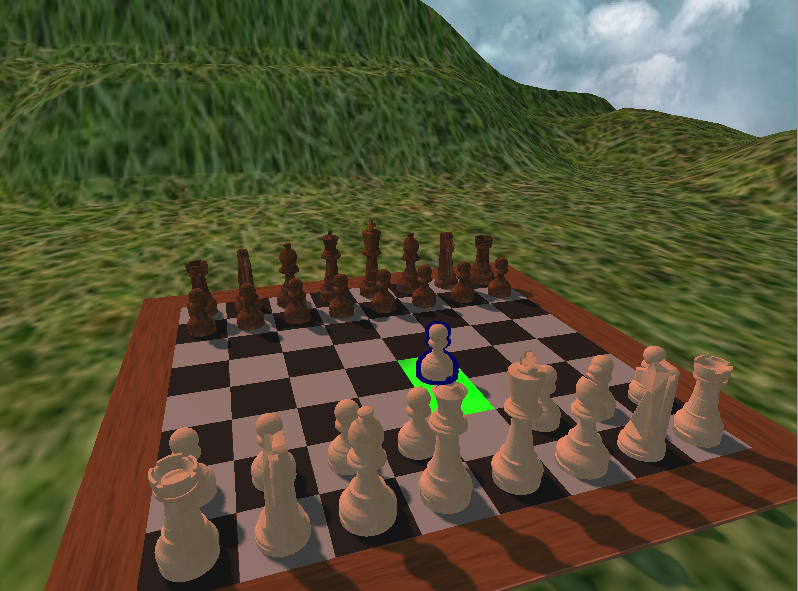

# pine
Physics 3D engine

Program służący do wizualizacji układu figur na szachownicy



## Requirements
1. CMake >= 3.15
2. Global Debian libraries: `sudo apt-get install libglew-dev libglm-dev`
3. Download these libraries to `libs` folder:
    - [stb image](https://github.com/nothings/stb/blob/master/stb_image.h)
    - [SDL 2.32](https://github.com/libsdl-org/SDL/releases/tag/release-2.32.10)

Tested on Ubuntu 24.04 and Arch Linux.

## Installation
```
mkdir build
cd build
cmake -DCMAKE_BUILD_TYPE=Debug ..
```

## Execute
`./run.sh`

## Features
### Render engine
- Teksturowanie modeli
- Skybox
- Światło kierunkowe
- Cienie światła kierunkowego (renderowanie pozaekranowe figur szachowych)
- Selekcja oraz obramowanie figur (bufor szablonowy)
- Płynne przemieszczanie figur na szachownicy (renderowanie pozaekranowe szachownicy, odczyt głębokości oraz rzutowanie wsteczne)

### Chess logic
Uproszczona walidacja przebiegu partii szachowej, która **nie** uwzględnia:
- podziału na tury (można wykonywać przemieszczanie figur w jednym kolorze wiele razy z rzędu)
- roszady
- promocji pionków
- bicia w przelocie
- zasady 3-krotnego powtórzenia pozycji
- zasady 50 posunięć

## Roadmap
TODO
