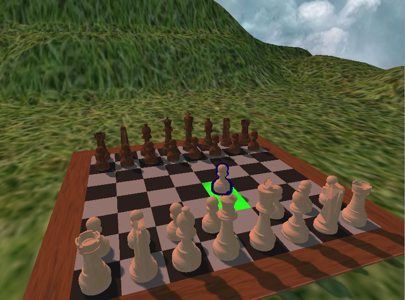

# pine
Basic 3D render engine written in C



## Requirements
### Global installation
cmake, libglew-dev, libglm-dev

### Local installation
Download these libraries to `libs/` directory:
[stb image](https://github.com/nothings/stb/blob/master/stb_image.h),
[SDL 2.32](https://github.com/libsdl-org/SDL/releases/tag/release-2.32.10),
[cglm 0.9](https://github.com/recp/cglm/releases/tag/v0.9.6)

## Installation
```
mkdir build
cd build
cmake -DCMAKE_BUILD_TYPE=Debug ..
```

## Execute
`./run.sh`

## Features
### Render engine
- Teksturowanie modeli
- Skybox
- Światło kierunkowe
- Cienie światła kierunkowego (renderowanie pozaekranowe figur szachowych)
- Selekcja oraz obramowanie figur (bufor szablonowy)
- Płynne przemieszczanie figur na szachownicy (renderowanie pozaekranowe szachownicy, odczyt głębokości oraz rzutowanie wsteczne)

## Tests
Application tested under Ubuntu 24.04 and Arch Linux.
