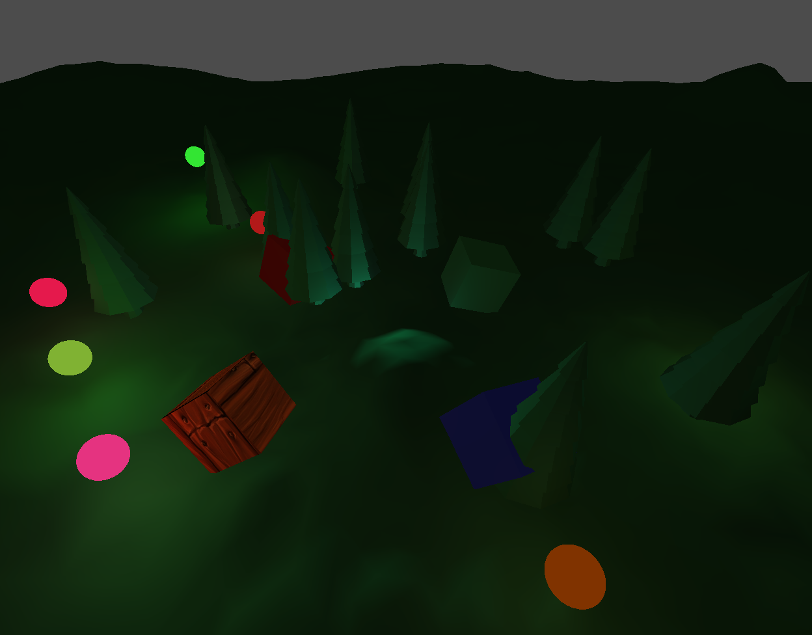
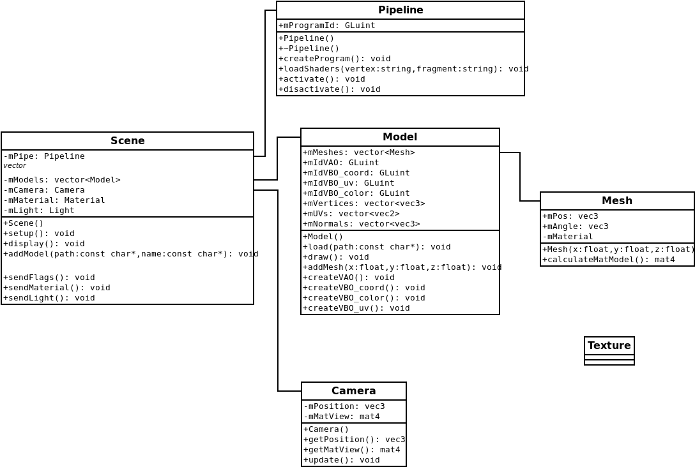

# Lab 6

## TODO

- zmiana widoczności niektórych pól klas na `private`

## Użycie programu

Aby uruchomić program, należy z katalogu `./Zad1` wpisać polecenie `make`

## Funkcjonalności

- dodane tekstury
- użycie klawiszów do edycji środowiska( lista ze skrótami klawiszowimi w konsoli )
- oświetlenie punktowe w cieniowaniu Phonga
- opcja zmiany modelu światła odbiciowego: Phonga oraz Blinna-Phonga
- opcja włączania/wyłączania oświetlenia
- opcja włączania/wyłączania animacji oświetlenia punktowego
- opcja przełączania 1 światła z punktowego na kierunkowe
- widoczność świateł punktowych oraz kierunkowego

## Zrzut ekranu

## ERD

